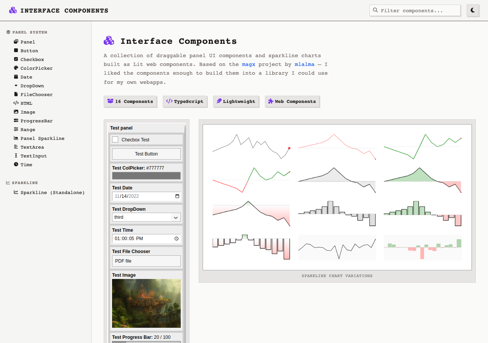
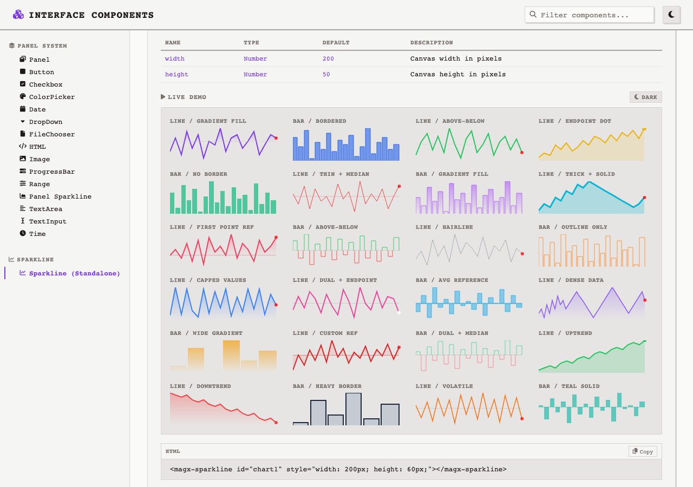
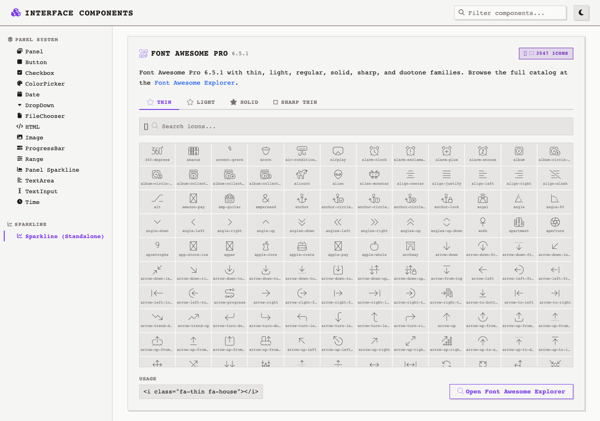

# Interface Components

Documentation and live demos for **magx** draggable panel UI components and sparkline charts, built as Lit web components and showcased with SvelteKit.

**Live:** [interface-components.pages.dev](https://interface-components.pages.dev/)



## Overview

A showcase and documentation site for 16 Lit 3 web components across two families. Each component has a live interactive demo, property table, code examples, and light/dark theme toggle. The site also includes a built-in Font Awesome Pro 6.5.1 icon browser with 3,500+ icons.

## Components

### Panel Family

Draggable, collapsible floating panels with built-in UI controls for building HUD-style interfaces.

| Component | Tag | Description |
|-----------|-----|-------------|
| Panel | `<magx-panel>` | Draggable, collapsible container with z-index management |
| Button | `<magx-panel-button>` | Clickable action button |
| Checkbox | `<magx-panel-checkbox>` | Toggle with label |
| Color Picker | `<magx-panel-colorpicker>` | Hex color selector with swatch preview |
| Date | `<magx-panel-date>` | Native date input |
| Dropdown | `<magx-panel-dropdown>` | Select menu with programmatic option setting |
| File Chooser | `<magx-panel-filechooser>` | File upload with filename display |
| HTML | `<magx-panel-html>` | Arbitrary HTML content via slot |
| Image | `<magx-panel-image>` | Image display with URL binding |
| Progress Bar | `<magx-panel-progressbar>` | Animated progress indicator |
| Range | `<magx-panel-range>` | Slider with min/max/step and value display |
| Panel Sparkline | `<magx-panel-sparkline>` | Inline sparkline chart embedded in panel |
| Text Area | `<magx-panel-textarea>` | Multi-line text input |
| Text Input | `<magx-panel-textinput>` | Single-line text/number/password input |
| Time | `<magx-panel-time>` | Native time picker |

### Sparkline Family



| Component | Tag | Description |
|-----------|-----|-------------|
| Sparkline | `<magx-sparkline>` | Standalone canvas-based chart with 30+ configuration options |

Sparkline supports line and bar charts with gradient/solid fills, above/below dual coloring, reference lines (average, median, custom), endpoint markers, upper/lower bounds with capping, and dynamic data streaming.

## Font Awesome Pro 6.5.1



Built-in icon browser with 3,500+ Font Awesome Pro icons across four weight families:

- **Thin** (100) -- hairline weight
- **Light** (300) -- lightweight
- **Solid** (900) -- filled weight
- **Sharp Thin** -- geometric thin variant

Tabbed interface with real-time search. Browse the full catalog at the [Font Awesome Explorer](https://fontawesome-explorer.atsignhandle.workers.dev/).

```html
<i class="fa-thin fa-house"></i>
<i class="fa-light fa-gear"></i>
<i class="fa-solid fa-star"></i>
<i class="fa-sharp fa-thin fa-circle-check"></i>
```

## Tech Stack

| Layer | Technology |
|-------|-----------|
| Components | [Lit 3](https://lit.dev/) with TypeScript decorators |
| Documentation site | [SvelteKit](https://kit.svelte.dev/) + Svelte 5 (runes) |
| Runtime | [Bun](https://bun.sh/) |
| Icons | [Font Awesome Pro 6.5.1](https://fontawesome.com/) |
| Hosting | [Cloudflare Pages](https://pages.cloudflare.com/) |

## Architecture

```
src/
  routes/
    +page.svelte          # Main page with all component demos
    +layout.svelte        # Site shell (header, sidebar, footer)
    +layout.ts            # Static prerendering config
  lib/
    components/           # Svelte UI components
      HeroSection.svelte  # Hero with stats badges
      ComponentCard.svelte # Component documentation card
      DemoContainer.svelte # Live demo wrapper with theme toggle
      FontAwesomeSection.svelte  # FA Pro icon browser
      ThemeToggle.svelte  # Site-wide dark/light toggle
      SearchBar.svelte    # Component search
      ...
    data/
      components.ts       # Component definitions (props, events, examples)
      fa-icons.ts         # Font Awesome Pro icon name catalog
    stores/
      search.ts           # Search query store
      demoTheme.ts        # Demo component theme store
    styles/
      theme.css           # CSS custom properties (light/dark)
      global.css          # Global styles
  hooks.client.ts         # Lit component registration + Panel CSS injection
magx/
  Panel/                  # Lit panel component source (TypeScript)
  Sparkline/              # Lit sparkline component source (TypeScript)
static/
  fontawesome/            # FA Pro 6.5.1 CSS + webfonts (self-hosted)
  screenshots/            # Documentation images
```

### Key Design Decisions

- **Lit components registered in `hooks.client.ts`** -- esbuild strips `@customElement` decorators, so all 16 elements are registered manually via `customElements.define()`.
- **Panel CSS injected as global `<style>` tag** -- Panel components read CSS custom properties (`:root` vars) that must pierce Shadow DOM boundaries. Light/dark theme swaps the entire CSS string.
- **Standalone sparklines use HTML attributes** -- All chart configuration (type, colors, fills, reference lines) is read from element attributes in the constructor, no programmatic setup needed.
- **Static adapter with prerendering** -- Full SSG via `@sveltejs/adapter-static`. Components hydrate on the client after prerendered HTML loads.

## Getting Started

```bash
# Install dependencies
bun install

# Development server (hot reload)
bun run dev

# Production build
bun run build

# Preview production build locally
bun run preview

# Deploy to Cloudflare Pages
bun run deploy
```

## Demo Theme Toggle

Each component demo includes a light/dark toggle that swaps the Panel CSS between `Panel.css` (light) and `Panel-Black.css` (dark). The toggle only affects the Lit components -- the site-wide theme is controlled separately via the header toggle.

## Attribution

Built on [magx](https://github.com/mlalma/magx/tree/main) by [mlalma](https://github.com/mlalma). I liked the component design enough to build it into a reusable library for web applications.

## License

MIT
